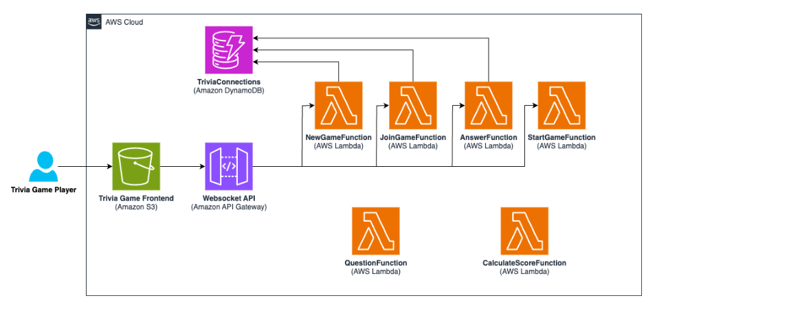
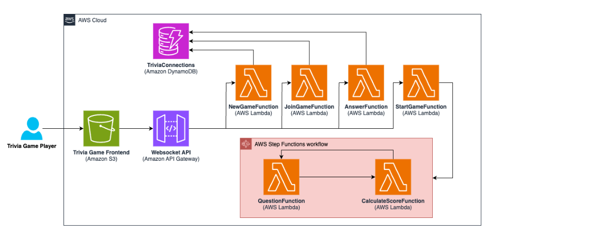

# 🎮 Building Serverless Workflows with AWS Step Functions

> This project documents an AWS Skill Builder lab where a serverless trivia game was enhanced using AWS Step Functions to orchestrate Lambda functions. The workflow manages the game lifecycle, including question delivery, waiting for player responses, score calculation, and game completion.

## Architecture

### Before


Initially, the application relied on individual Lambda functions to control the game flow, making orchestration difficult as the application evolved.

### After


The application now uses AWS Step Functions to orchestrate the workflow, improving readability, maintainability, and error handling.

## Services Used

| Service | Purpose |
|---|---|
| Amazon S3 | Static website hosting |
| API Gateway (WebSocket) | Real-time communication |
| AWS Lambda | Serverless business logic |
| Amazon DynamoDB | Store game sessions and player scores |
| AWS Step Functions | Workflow orchestration |
| IAM | Permissions |

## Workflow


```
Start
  ↓
Question
  ↓
Wait
  ↓
Calculate Scores
  ↓
Is Game Over?
  ├── No  → Question
  └── Yes → Game Over
```

## Amazon States Language


The workflow is defined using Amazon States Language (ASL), the JSON-based language used by AWS Step Functions.

## How it Works

```
Player
  ↓
Create Game
  ↓
NewGameFunction
  ↓
StartGameFunction
  ↓
Step Functions
  ↓
Question
  ↓
Wait
  ↓
Calculate Scores
  ↓
Choice
  ↓
Loop or Finish
```

## Key Concepts Learned

- Serverless workflow orchestration
- State machines
- JSONPath
- ResultSelector
- ResultPath
- Wait state
- Choice state
- Lambda integration
- Environment variables
- Amazon Resource Name (ARN)

## Real-World Applications

Step Functions are commonly used to orchestrate long-running business processes where multiple AWS services must work together.

- Order processing
- Loan approval
- ETL pipelines
- Document processing
- AI workflows
- Serverless microservices

## What I Learned

Through this lab I learned how Step Functions separate orchestration logic from business logic. Instead of Lambda functions invoking each other, the workflow controls execution, making applications easier to maintain and scale. I also learned how JSON state is propagated across workflow steps using JSONPath, ResultSelector, and ResultPath.

## Screenshots

|Game In Progress | Game Over |

 |  |  |

## Assessment

| Metric | Result |
|---|---|
| Score | 100% |
| Correct Answers | 5/5 |
| Attempt | 1 |

---

## Developer Associate Notes

### Why Step Functions instead of Lambda chaining?

- Separation of concerns
- Built-in retries
- Error handling
- Visual workflow
- State management
- Scalability
