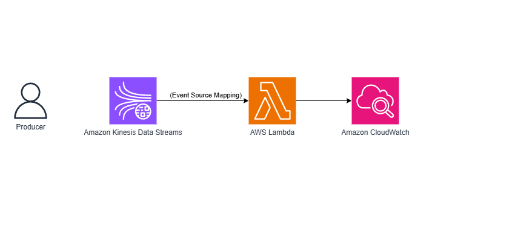
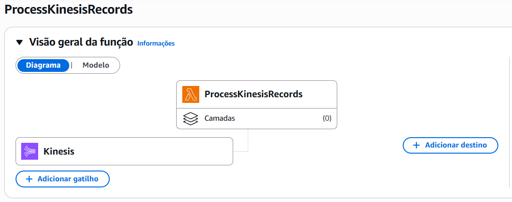
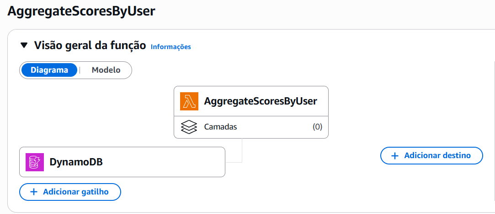

# ⚡ Event-Driven Architectures with Amazon Kinesis, DynamoDB Streams, and AWS Lambda

This project documents an AWS Skill Builder lab where I built two different event-driven serverless architectures using Amazon Kinesis, Amazon DynamoDB Streams, and AWS Lambda.

The lab demonstrates how AWS services exchange events asynchronously without direct communication, allowing applications to scale efficiently while remaining loosely coupled.

## Architecture

### Part 1 — Kinesis Data Stream



The first architecture receives streaming data through Amazon Kinesis. AWS Lambda consumes records using an Event Source Mapping, processes batches of events, and sends execution logs to Amazon CloudWatch.



### Part 2 — DynamoDB Streams


The second architecture uses DynamoDB Streams to automatically trigger a Lambda function whenever new records are inserted into the database.

The Lambda function aggregates player scores and updates a second DynamoDB table.



## Services Used

| Service | Purpose |
|---|---|
| Amazon Kinesis Data Streams | Real-time event streaming |
| AWS Lambda | Serverless event processing |
| Amazon DynamoDB | NoSQL database |
| DynamoDB Streams | Capture table changes |
| Amazon CloudWatch | Logs and monitoring |
| IAM | Permissions |

## Event Flow

### Part 1 — Kinesis

```
Producer
      │
      ▼
Amazon Kinesis Stream
      │
Event Source Mapping
      │
      ▼
AWS Lambda
      │
      ▼
Amazon CloudWatch Logs
```

### Part 2 — DynamoDB Streams

```
Insert Item
      │
      ▼
GameScoreRecords
      │
DynamoDB Streams
      │
Event Source Mapping
      │
      ▼
AWS Lambda
      │
      ▼
GameScoresByUser
```

## How it Works

### Streaming Architecture

A producer continuously sends events to an Amazon Kinesis Data Stream.

AWS Lambda consumes records asynchronously using an Event Source Mapping, decodes the incoming payloads, processes each record, and publishes execution logs to Amazon CloudWatch.


### Database Event Architecture

Whenever a new item is inserted into the `GameScoreRecords` table, DynamoDB Streams captures the change.

The stream automatically invokes a Lambda function that aggregates the score and updates the `GameScoresByUser` table.

No polling is required because the architecture is completely event-driven.

**GameScoresByUser table after the first insert (user `jane`):**


**GameScoresByUser table after a second insert (users `Jane` and `Laísa`):**


**Lambda test log confirming the aggregation for `jane`:**


## Key Concepts Learned

- Event-Driven Architecture
- Amazon Kinesis Data Streams
- DynamoDB Streams
- Event Source Mapping
- AWS Lambda Blueprints
- Batch Processing
- Base64 decoding
- Amazon CloudWatch Logs
- Latest vs TRIM_HORIZON
- Serverless integrations
- Real-time stream processing
- Asynchronous workloads

## Real-World Applications

This architecture is commonly used in systems that process continuous streams of events or react automatically to database changes.

- Payment processing
- IoT telemetry
- Clickstream analytics
- Gaming leaderboards
- Fraud detection
- Order processing
- Audit logging
- User activity tracking

## What I Learned

Through this lab I learned how AWS implements event-driven architectures using different event sources.

I understood the differences between Amazon Kinesis and DynamoDB Streams, when each service should be used, how Event Source Mappings connect event producers to Lambda functions, and how CloudWatch helps monitor serverless applications.

I also explored the impact of Latest and TRIM_HORIZON starting positions, how batch processing affects throughput, and why loosely coupled architectures are fundamental for scalable cloud-native applications.

## Assessment

| Metric | Result |
|---|---|
| Score | 100% |
| Correct Answers | 6/6 |
| Attempt | 1 |
| Average Time | 1m 40s/question |

## Developer Associate Notes

### Kinesis vs DynamoDB Streams

| Amazon Kinesis | DynamoDB Streams |
|---|---|
| Dedicated streaming platform | Database change stream |
| Producer sends records | Triggered by table updates |
| High-throughput ingestion | CDC (Change Data Capture) |
| Supports multiple consumers | Tightly coupled to DynamoDB |
| Suitable for real-time analytics | Suitable for event-driven applications |

### Latest vs TRIM_HORIZON

**Latest** → processes only new records arriving after the consumer starts.

**TRIM_HORIZON** → processes all available records from the oldest retained event.

### Why Event Source Mapping?

Event Source Mapping continuously polls the stream on behalf of Lambda, retrieves records in batches, manages checkpoints, retries failed batches, and invokes the Lambda function automatically.